<picture>
  <source media="(prefers-color-scheme: dark)" srcset="assets/header-dark.svg">
  
</picture>

<picture>
  <source media="(prefers-color-scheme: dark)" srcset="assets/secao-sobre-dark.svg">
  
</picture>

Oi, eu sou o Filipe. Estudo Cibersegurança na CESAR School, em Recife, e faço parte da Equipe de Cibersegurança do Núcleo Open Source da CESAR School.

Gosto de entender como as coisas quebram e de automatizar a infraestrutura que roda elas. Já fiz o curso de pentest da Tempest e hoje divido meu tempo entre segurança de aplicações, detecção com Wazuh e DevOps.

<picture>
  <source media="(prefers-color-scheme: dark)" srcset="assets/secao-lab-dark.svg">
  
</picture>

Em casa montei um lab de blue/red team. O desktop roda o Wazuh como servidor (SIEM) e o notebook é a máquina de ataque. O ciclo é sempre o mesmo: ataco o alvo, analiso os alertas no Wazuh, escrevo regras de detecção e contenções e ataco de novo pra ver se funcionou.

Ainda não tem repositório. É um lab em andamento.

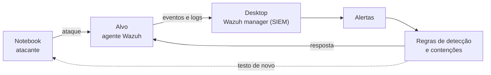

<picture>
  <source media="(prefers-color-scheme: dark)" srcset="assets/secao-projetos-dark.svg">
  
</picture>

<p align="center">
<a href="https://github.com/Fililpe/safe-console-c"><picture>
  <source media="(prefers-color-scheme: dark)" srcset="assets/card-safe-console-c-dark.svg">
  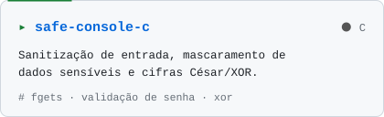
</picture></a>
<a href="https://github.com/Fililpe/cifrario"><picture>
  <source media="(prefers-color-scheme: dark)" srcset="assets/card-cifrario-dark.svg">
  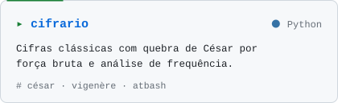
</picture></a>
</p>

<p align="center">
<a href="https://github.com/Fililpe/grupo4-ansible-guia"><picture>
  <source media="(prefers-color-scheme: dark)" srcset="assets/card-grupo4-ansible-guia-dark.svg">
  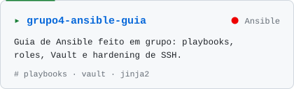
</picture></a>
<a href="https://github.com/Fililpe/Vagrant-Jenkins"><picture>
  <source media="(prefers-color-scheme: dark)" srcset="assets/card-Vagrant-Jenkins-dark.svg">
  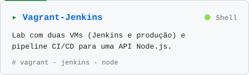
</picture></a>
</p>

<p align="center">
<a href="https://github.com/Fililpe/pipeline-jenkins-nodejs"><picture>
  <source media="(prefers-color-scheme: dark)" srcset="assets/card-pipeline-jenkins-nodejs-dark.svg">
  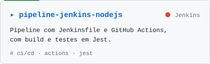
</picture></a>
<a href="https://github.com/Fililpe/Terraform"><picture>
  <source media="(prefers-color-scheme: dark)" srcset="assets/card-Terraform-dark.svg">
  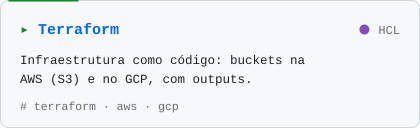
</picture></a>
</p>

<picture>
  <source media="(prefers-color-scheme: dark)" srcset="assets/secao-atividade-dark.svg">
  
</picture>

<picture>
  <source media="(prefers-color-scheme: dark)" srcset="assets/atividade-dark.svg">
  
</picture>

<picture>
  <source media="(prefers-color-scheme: dark)" srcset="assets/secao-estudando-dark.svg">
  
</picture>

```text
[em andamento]  PortSwigger Web Security Academy (labs)
[em andamento]  Pacific Security (módulos)
[em andamento]  Detecção e resposta com Wazuh
[em andamento]  DevOps na Aponti: Vagrant, Jenkins, Ansible, Terraform, GitHub Actions
[concluído]     Curso de pentest da Tempest
```

<picture>
  <source media="(prefers-color-scheme: dark)" srcset="assets/secao-stack-dark.svg">
  
</picture>

```text
linguagens   C · Python · JavaScript · Shell
segurança    Wazuh · secure coding · validação de entrada · criptografia clássica · hardening
devops       Terraform · Ansible · Vagrant · Jenkins · GitHub Actions · Git
cloud        AWS · GCP
```

<picture>
  <source media="(prefers-color-scheme: dark)" srcset="assets/secao-contato-dark.svg">
  
</picture>

[LinkedIn](https://www.linkedin.com/in/luizfilipesousa/) · [lfsjs@cesar.school](mailto:lfsjs@cesar.school)

<br>

<details>
<summary><b>English version</b></summary>

<br>

Hi, I'm Filipe. I study Cybersecurity at CESAR School in Recife, Brazil, and I'm part of the Cybersecurity Team at CESAR School's Open Source Hub.

I like understanding how things break and automating the infrastructure that runs them. I've completed Tempest's pentest course, and right now I split my time between application security, detection with Wazuh and DevOps.

**Homelab (in progress).** My desktop runs Wazuh as the server (SIEM) and my laptop is the attacking machine. I attack the target, analyze the alerts, write detection rules and containment actions, then attack again to check they work. There's no repository for it yet.

**Projects.** A C command line tool for input sanitization and masking sensitive data ([safe-console-c](https://github.com/Fililpe/safe-console-c)), a Python library of classical ciphers with cryptanalysis ([cifrario](https://github.com/Fililpe/cifrario)), a group guide to Ansible covering Vault and SSH hardening ([grupo4-ansible-guia](https://github.com/Fililpe/grupo4-ansible-guia)), CI/CD labs with Vagrant, Jenkins and GitHub Actions ([Vagrant-Jenkins](https://github.com/Fililpe/Vagrant-Jenkins), [pipeline-jenkins-nodejs](https://github.com/Fililpe/pipeline-jenkins-nodejs)) and Terraform on AWS and GCP ([Terraform](https://github.com/Fililpe/Terraform)).

**Currently studying.** PortSwigger Web Security Academy labs, Pacific Security modules, detection and response with Wazuh, and DevOps (Vagrant, Jenkins, Ansible, Terraform, GitHub Actions) through Aponti's course.

</details>
